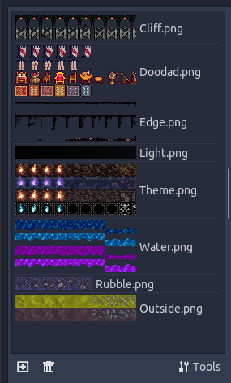

# SetOrder

Set the order of Tile Ids in Godot TileMap TileSet.

**Warning: changing tile ids can break existing code or maps that use existing ids.**

- Copy input text from tile set into in.txt
- Run, set order, save
- Copy back from out.txt
